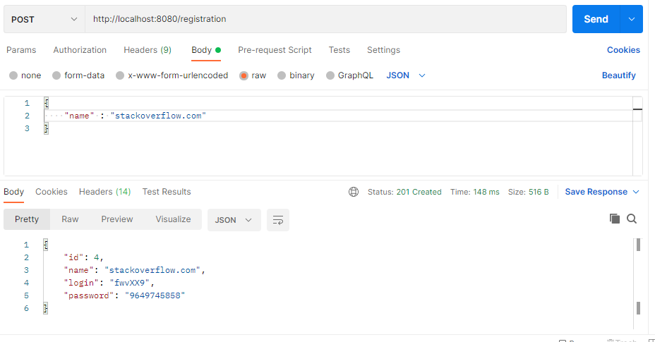
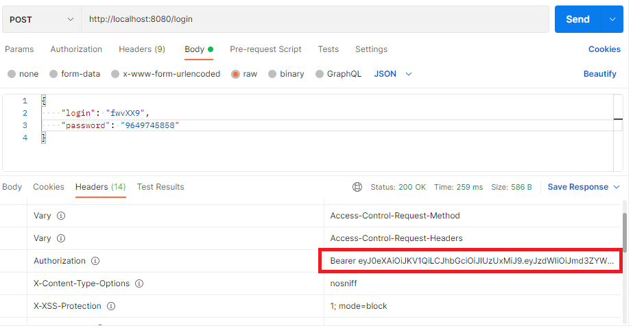
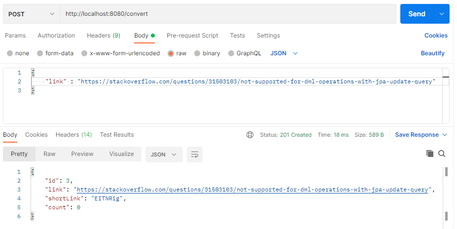
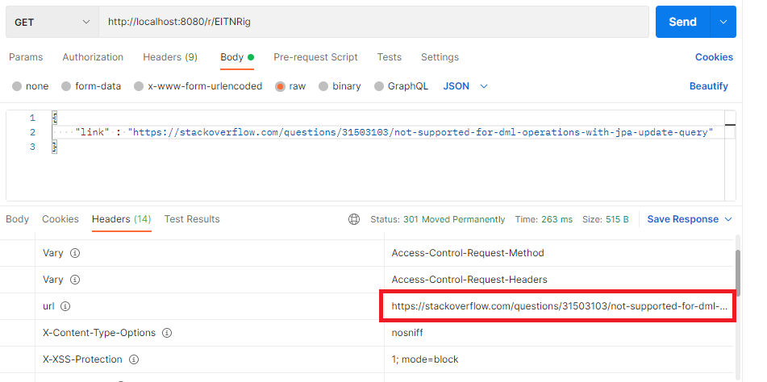
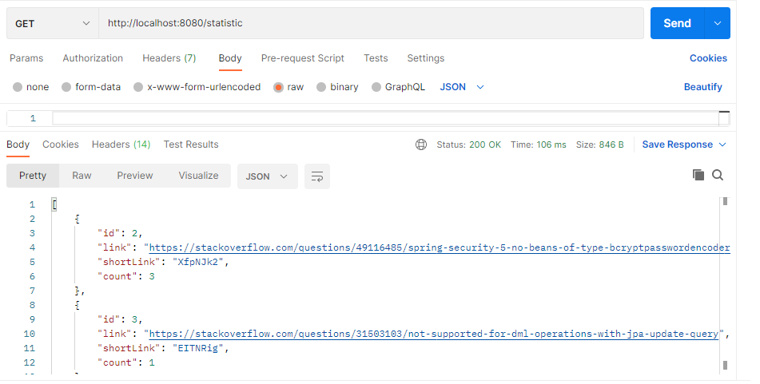

***
## UrlShortCut 

Сервис обеспечивает безопасность пользователей при переходе по ссылке, предоставляя им возможность заменить её на сокращенную.
Сервис работает через REST API. 

При разработке использовались следующие технологии:

- Java 11
- Spring Boot
- Spring Data JPA
- Spring Security
- JSON Web Token
- PostgreSQL
- Maven

***

Вначале владельцу сайта необходимо зарегистрироваться

POST: 
```
/registration
```


Затем, необходимо добавить в заголовок JWT с помощью полученных при регистрации данных.
POST: 
```
/login
```


Теперь пользователю доступен функционал сокращения ссылки.
POST: 
```
/convert
```


Теперь по полученному ключу можно получить полную ссылку. Для этого не нужно быть зарегестрированным в системе.
GET: 
```
/r/**
```


Также пользователи, указавшие JWT в заголовке, могут получить статистику, содержащию количество переходов.
GET: 
```
/statistic
```


